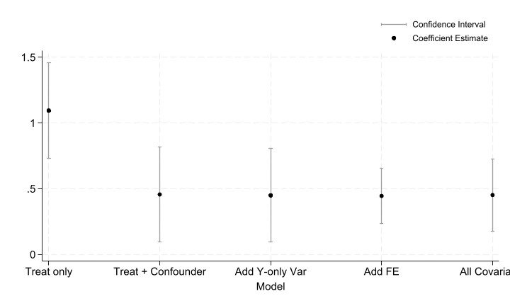

# ppol6818-ss4925

# Part 3: De-biasing a Parameter Estimate Using Controls

## Objective

This project simulates how controlling for covariates and including fixed effects can reduce bias in estimating a treatment effect in the presence of confounding. We examine the convergence and bias of treatment effect estimates across different regression models and sample sizes.

## Data Generating Process (DGP)

Simulate individual-level data with the following components:

- **Outcome (`outcome`)**: Constructed as a function of:
  - The true treatment effect (set to **0.5**),
  - A confounder,
  - A variable that affects the outcome only,
  - Fixed group effects,
  - Random noise.
- **Treatment (`treat`)**: Assigned probabilistically based on two covariates:
  - A confounder (affects both treatment and outcome),
  - A variable that affects treatment only.
- **Covariates**:
  - `confounder`: Influences both treatment assignment and outcome.
  - `yvary`: Influences the outcome only.
  - `tvary`: Influences treatment assignment only.
- **Strata (`group_id`)**: Simulated grouping variable (5 groups) that affects the outcome.
- **Noise (`noise`)**: Random error term drawn from a normal distribution.

The DGP is designed so that at least one continuous covariate acts as a confounder while another influences only one part of the model. This allows us to test omitted variable bias.

## Regression Models

Run five regression models on the simulated data:

1. **Model 1**: Regression with treatment only.
2. **Model 2**: Regression with treatment and the confounder.
3. **Model 3**: Regression with treatment, the confounder, and the outcome-only variable.
4. **Model 4**: Model 3 with additional fixed effects for the strata (`group_id`).
5. **Model 5**: Model 4 with an additional variable that affects treatment only (included to demonstrate its lack of benefit in reducing bias).

## Simulation Setup

- **Sample Sizes**: Simulations are run for sample sizes of `100`, `250`, `500`, `1000`, `5000`, and `10000`.
- **Replications**: For each sample size and model, **100 replications** are executed.
- **Outputs**: For each run, we record:
  - The estimated treatment coefficient,
  - The lower and upper bounds of the 95% confidence interval.
  
These outputs are aggregated and used to generate figures and tables comparing the bias and convergence of the estimates.

## Results

### Figures

1. **Coefficient Convergence**:  
   - Plots the mean treatment effect estimate and its confidence interval across different sample sizes.
   - Demonstrates that models controlling for confounding and fixed effects converge to the true treatment effect faster as N increases.

2. **Model Bias & Variance Comparison**:  
   - Compares the bias and variance of treatment effect estimates across the five models.
   - Highlights the importance of adjusting for confounders and the benefits of using fixed effects.

### Tables

- **Sample Size Table**: Shows the mean treatment coefficient and confidence intervals for each sample size.

- **Model Comparison Table**: Summarizes the performance (bias and variance) of each regression model.

## Key Takeaways

- **Omitting confounders** leads to biased treatment effect estimates.
- **Including covariates** that affect only one aspect of the model (either treatment or outcome) does not necessarily reduce bias and may even increase variance.
- **Fixed effects** help to adjust for unobserved heterogeneity in grouped data.
- **Sample size** significantly influences the precision and convergence of estimates—larger sample sizes yield more reliable estimates, especially when using models that account for confounding.

## Conclusion

This project demonstrates how the inclusion of proper covariates and fixed effects can reduce bias in estimating a treatment effect. The simulation results provide insights into model specification and sample size requirements, guiding better design decisions in empirical research.
