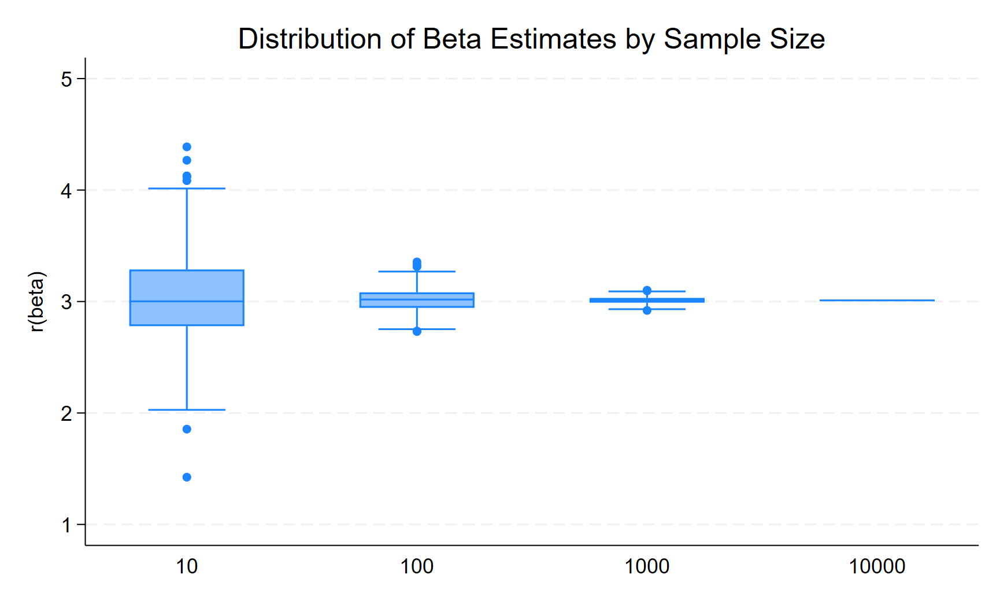
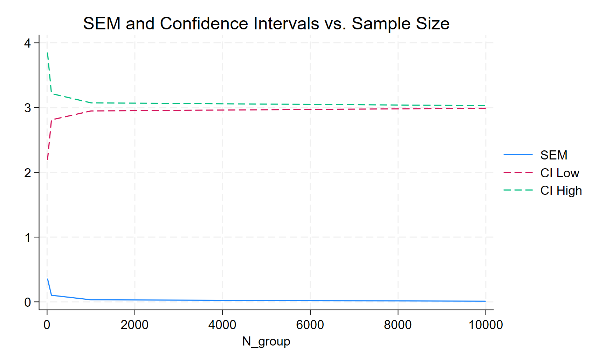
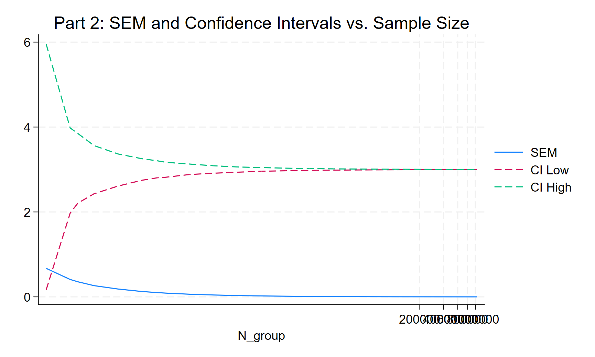

# ppol6818-ss4925
# Stata 3

## Part 1: Fixed Population
### Setup
Simulated samples from a fixed population of 10,000.
Simulated Sample Sizes: 
- 10, 100, 1,000, 10,000
- 500 simulations per sample size

### Results Summary
- As sample size increases, **SEM and CI width shrink**
- However, they **plateau** after N = 10,000 due to the population limit

## Part 2: Infinite Superpopulation
### Setup
Generated new data from the same DFP in every simulation (superpopulation).
Simulated Sample Sizes: first 20 powers of 2 & first 6 powers of 10.

### Results Summary
- SEM and CI width **continue shrinking** with increasing sample size
- Demonstrates the **law of large numbers** with no upper limit

## Part 1 vs Part 2 Comparison
### Part 1 Table

### Part 2 Table

Part 1 hits a max sample size of 10,000. Part 2 simulated beyond that by regenerating data. While SEM for Part 1 (fixed population) plateaus at sample size 10,000, SEM for Part 2 (superpopulation) continues to shrink. Furthermore, while CI width for Part 1 (fixed population) cannot shrink beyond the population size, that of Part 2 (superpopulation) continues to narrow with consinuously increasing population size.

## Conclusion
This simulation exercise implies:
- How sample size influences precision
- The difference between sampling from a **finite dataset** vs. an **infinite DGP**
- How SEM and confidence intervals behave across different sampling strategies